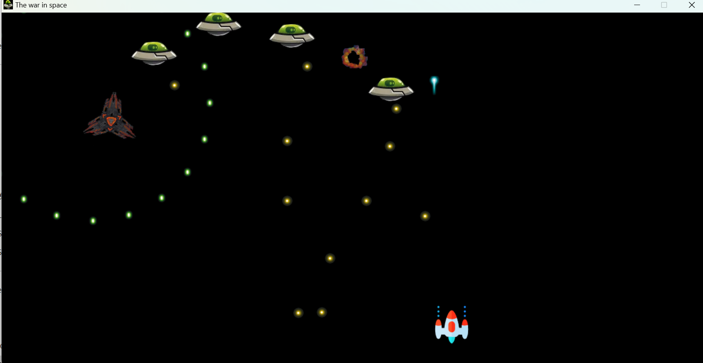

# 飞机射击游戏
这是一个使用Python编写的飞机射击Windows桌面小游戏。
### 游戏简介
这个游戏是一个经典的飞机射击游戏，玩家需要操控飞机，尽可能地消灭敌方飞机，避开敌方的子弹，同时躲避敌方飞机的攻击。消灭敌人，让玩家能够享受到挑战和成就感。
### 游戏特色
* 简单易上手，适合所有年龄段的玩家。
* 游戏操作简单，使用方向键控制飞机的移动，按空格键进行射击。
* 有游戏音效和背景音乐，增加游戏的趣味性和氛围。
### 游戏安装与运行
1. 确保你已经安装了Python 3.x版本。
2. 克隆或下载本游戏的源代码到你的本地机器。
3. 在命令行窗口中，进入游戏源代码所在的目录。
4. 运行以下命令启动游戏 ( 或直接双击运行main.exe )：
  ``` css
  python main.py
```
 
### 游戏操作
* 使用方向键（上、下、左、右）控制飞机的移动。
* 按空格键进行射击。
 ### 游戏截图
 
 ### 贡献
 欢迎对本项目提出问题、报告Bug或提供改进建议。你可以通过提交Issue或Pull Request的方式进行贡献。
 ### 版权信息
 本游戏遵循 MIT 许可证。